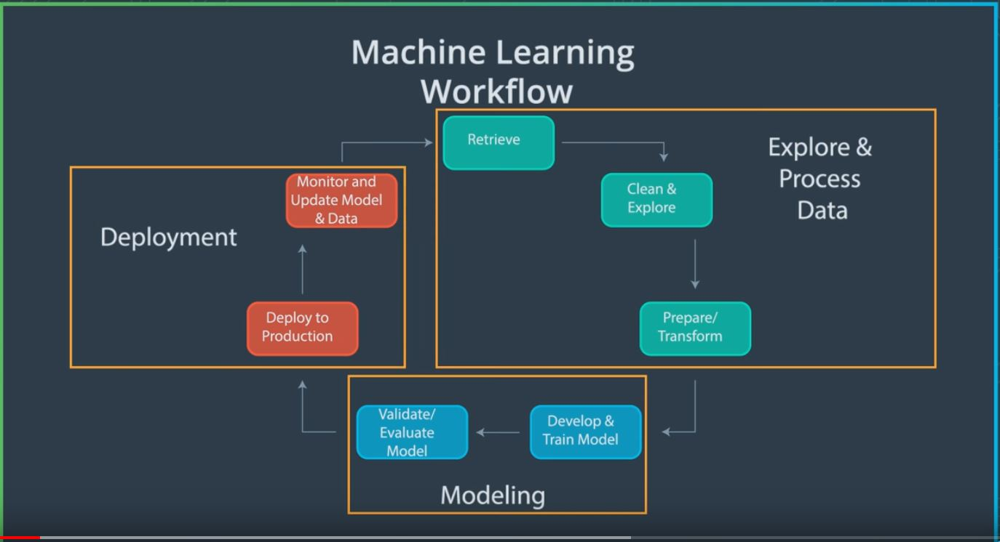
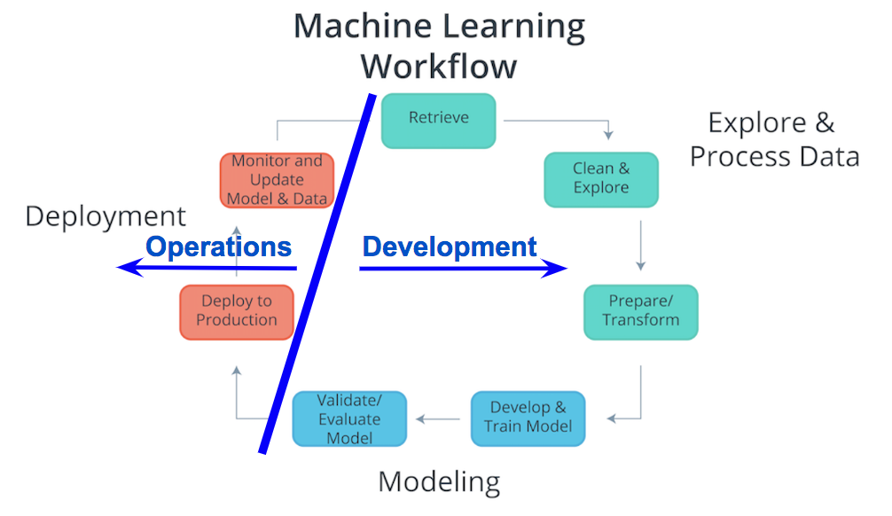

# 1. Introduction to deployment

## ML workflow

Major steps in ML workflow are:
1. Explore and process dara
2. Modeling
3. Deployment
Each major cloud provide have their own ML workflow defined.
1. Amazon Web Services (AWS) discusses their definition of the [Machine Learning Workflow](https://docs.aws.amazon.com/sagemaker/latest/dg/how-it-works-mlconcepts.html).

2. Google Cloud Platform (GCP) discusses their definition of the [Machine Learning Workflow](https://cloud.google.com/ai-platform/docs/ml-solutions-overview).

3. Microsoft Azure (Azure) discusses their definition of the [Machine Learning Workflow](https://docs.microsoft.com/en-us/azure/machine-learning/overview-what-is-azure-ml).

## What is cloud computing and why we use it 

**Cloud computing** can simply be thought of as transforming an Information Technology (IT) product into a service.Generally, think of **cloud computing** as using an internet connected device to log into a cloud computing service to access an *IT resource*. These IT resources are stored in the cloud provider’s data center.
Most of the factors related to choosing cloud computing services, instead of developing on-premise IT resources are related to time and cost. The capacity utilization graph below shows how cloud computing compares to traditional infrastructure (on-premise IT resources) in meeting customer demand. 

Looking at the graph, notice that traditional infrastructure doesn't scale when there are spikes in demand, and also leaves excess when preparing for future demand. This ability to easily meet unstable, fluctuating customer demand illustrates many of the benefits of cloud computing.
### Risks of using loud computing

1. Potential) Increase in Security Vulnerabilities
2. Reduced Operational Governance Control (over cloud resources)
3. Limited Portability Between Cloud Providers
4. Multi-regional Compliance and Legal Issues

### Benefits
1. Proportional cost
2. Increased Availability
3. Increased Realiability

**Deployment** is typically critical part of the machine learning *in the workplace* which is not the case *with academic or personal usage* therefore it is *sometimes* included in as part of ML workflow.

## Deployment to production

`Deployment to production` can simply be thought of as a method that integrates a machine learning model into an existing production environment so that the model can be used to make decisions or predictions based upon data input into the model. 

There are `three primary methods` used to transfer a model from the modeling component to the deployment component of the machine learning workflow. Following are listed in order of least to most commonly used. The third method that's most similar to what’s used for *deployment within Amazon’s SageMaker.*
Paths to Deployment:
1. Python model is recoded into the programming language(like Java,C+ etc) of the production environment.
	This method is rarely used anymore because it takes time to recode, test, and validate the model that provides the same predictions as the original.
2. Model is coded in *Predictive Model Markup Language* (PMML) or *Portable Format Analytics* (PFA).
	The Data Mining Group developed both `PMML` and `PFA` to provide vendor-neutral executable model specifications for certain predictive models used by data mining and machine learning. Certain analytic software allows for the *direct import of PMML* including but not limited to IBM SPSS, R, SAS Base & Enterprise Miner, Apache Spark, Teradata Warehouse Miner, and TIBCO Spotfire.
3. Python model is converted into a format that can be used in the production environment.
	Use libraries and methods that convert the model into code that can be used in the production environment. Specifically most popular machine learning software frameworks, like PyTorch, TensorFlow, SciKit-Learn, have methods that will convert Python models into intermediate standard format, like [`ONNX (Open Neural Network Exchange format)`](https://onnx.ai/). This intermediate standard format then can be converted into the software native to the production environment. 
	- This is the easiest and fastest way to move a Python model from modeling directly to deployment.
    - Moving forward this is typically the way models are moved into the production environment.
    - Technologies like containers, endpoints, and APIs (Application Programming Interfaces) also help ease the work required for deploying a model into the production environment.

### ML Models and Devops

Considering the components of the Machine Learning Workflow, one can see how Exploring and Processing Data is tightly coupled with Modeling. The modeling can’t occur without first having the data the model will be based upon prepared for the modeling process.

Comparatively deployment is more tightly coupled with the production environment than with modeling or exploring and processing the data. Therefore, traditionally there’s was a separation between Deployment and the other components of the machine learning workflow. Specifically looking at the diagram above, the `Process Data and Modeling` are considered `Development`; whereas, `Deployment` is typically considered `Operations`.
In the past typically, `development was handled by analysts`; whereas, `operations was handled by software developers` responsible for the production environment. With recent developments in technology (containers, endpoints, APIs) and the most common path of deployment; this division between development and operations softens. The softening of this division enables analysts to handle certain aspects of deployment and enables faster updates to faltering models. 

The application communicates with the model through an interface to the model called an endpoint
Communication between the application and the model is done through the endpoint (interface), where the endpoint is an Application Programming Interface (API).
- An easy way to think of an API, is as a set of rules that enable programs, here the application and the model, to communicate with each other.
- In this case, our API uses a REpresentational State Transfer, REST, architecture that provides a framework for the set of rules and constraints that must be adhered to for communication between programs.
- This REST API is one that uses HTTP requests and responses to enable communication between the application and the model through the endpoint (interface).
- Noting that both the HTTP request and HTTP response are communications sent between the application and model.
### Request consists of 4 parts
1. Endpoint
   This endpoint will be in the form of a URL, Uniform Resource Locator, which is commonly known as a web address.
2. HTTP Method
   Below you will find four of the HTTP methods, but for purposes of deployment our application will use the POST method only.
3.HTTP Headers
  The headers will contain additional information, like the format of the data within the message, that’s passed to the receiving program.
4. Message (Data or Body)
   The final part is the message (data or body); for deployment will contain the user’s data which is input into the mode

### Response consists of 3 parts
- HTTP Status Code
  - If the model successfully received and processed the user’s data that was sent in the message, the status code should start with a 2, like 200.
- HTTP Headers
  - The headers will contain additional information, like the format of the data within the message, that’s passed to the receiving program.
- Message (Data or Body)
  - What’s returned as the data within the message is the prediction that’s provided by the model.

## Models, Apllications and Containers

- The `model` is simply the Python model that's created, trained, and evaluated in the Modeling component of the machine learning workflow.
- The `application` is simply a web or software application that enables the application users to use the model to retrieve predictions.
- The model and the application require a computing environment.One way to create and maintain these computing environments is through the use of `containers`.The `containers` are created using a script that contains instructions on which software packages, libraries, and other computing attributes are needed in order to run a software application, in our case either the model or the application. `A container can be thought of as a standardized collection/bundle of software that is to be used for the specific purpose of running an application.`A common container software is Docker. Due to its popularity sometimes Docker is used synonymously with containers.

### Advantages of containers

1. Isolates the application, which increases security.
2. Requires only software needed to run the application, which uses computational resources more efficiently and allows for faster application deployment.
3. Makes application creation, replication, deletion, and maintenance easier and the same across all applications that are deployed using containers.
4. Provides a more simple and secure way to replicate, save, and share containers.

## Characteristics of Deployment and Modelling

Deployment to production can simply be thought of as a method that integrates a machine learning model into an existing production environment so that the model can be used to make decisions or predictions based upon data input into this model. 

`Hyperparameters` : In machine learning, a hyperparameter is a parameter whose value cannot be estimated from the data. 

1. `Model Versioning`: Besides saving the model version as a part of a model’s metadata in a database, the deployment platform should allow one to indicate a deployed model’s version.This will make it easier to maintain, monitor, and update the deployed model.
2. `Model Monitoring`:Once a model is deployed you will want to make certain it continues to meet its performance metrics; otherwise, the application may need to be updated with a better performing model. 
3. `Model Updating and Routing` :Model need to be updated if a deployed model is failing to meet its performance metrics or here's been a fundamental change in the data that’s being input into the model for predictions.*The deployment platform should support routing differing proportions of user requests to the deployed models*; to allow comparison of performance between the deployed model variants. 
4. `Model Prediction` :There are two common types of predictions:
    1. On-demand predictions
    2. Batch predictions
### Online Prediction
- `On-demand predictions` might also be called:
    - online,
    - real-time, or
    - synchronous predictions
- With these type of predictions, one expects:
  - A low latency of response to each prediction request,but allows for possibility high variability in request volume.
  - Predictions are returned in the response from the request. Often these requests and responses are done through an API using JSON or XML formatted strings.
  - Each prediction request from the user can contain one or many requests for predictions. Noting that many is limited based upon the size of the data sent as the request. Common cloud platforms on-demand prediction request size limits can range from 1.5(ML Engine) to 5 Megabytes (SageMaker).
### Batch Prediction
- Batch predictions might also be called:
  - asynchronous, or
  - batch-based predictions.
- With these type of predictions, one expects:
  - High volume of requests with more periodic submissions so latency won’t be an issue.
  - Each batch request will point to specifically formatted data file of requests and will return the predictions to a file. Cloud services require these files will be stored in the cloud provider’s cloud.
  - Cloud services typically have limits to how much data they can process with each batch request based upon limits they impose on the size of file you can store in their cloud storage service. For example, Amazon’s SageMaker limits batch predictions requests to the size limit they enforce on an object in their S3 storage service.

![Cloud Computing ]{img/nistcloudcomputing.png}

`Platform as a Service`:With Platform as a Service, PaaS, the yellow dashed line demonstrates that the customer gains additional responsibilities that are associated with managing all applications and data, such as including a user interface and dashboard, security, logs, and other features associated to the data and applications.Some examples of Platform as a Service, are Heroku and Engine Yard. These services allow users to easily build, host, monitor, and scale their applications using their platform. 

`Infrastructure as a Service`:With the service model Infrastructure as a Service, IaaS, as shown with the yellow dashed line; the customer has most of the responsibility beyond those associated with running secure data centers and maintaining the hardware and software that enables IaaS.Some examples of IaaS are Amazon Web Services and Rackspace, which were among the first to offer Infrastructure as a Service that allowed their customers to use virtual machines. 

